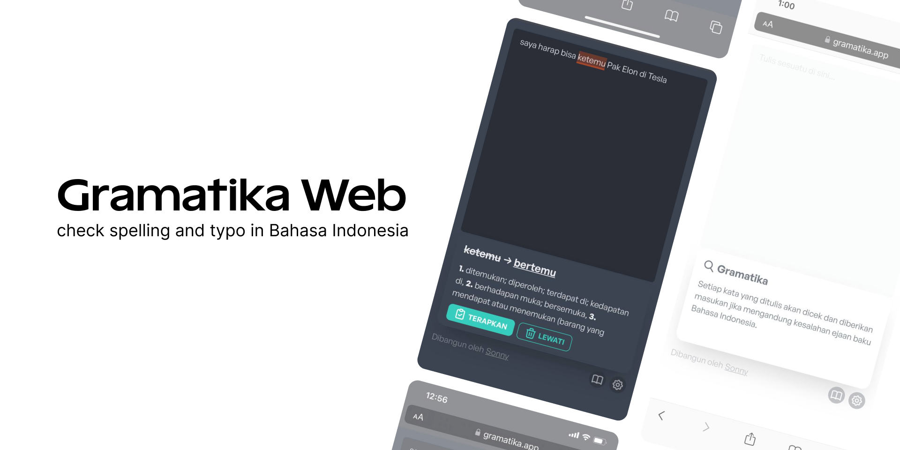

# Gramatika Web

Gramatika web helps you to check spelling and typo in Bahasa Indonesia



## Development

To run the app locally, make sure your project's local dependencies are installed:

```sh
yarn
```

Afterwards, start the Remix development server like so:

```sh
yarn dev
```

Open up [http://localhost:3000](http://localhost:3000) and you should be ready to go!

If you're used to using the `vercel dev` command provided by [Vercel CLI](https://vercel.com/cli) instead, you can also use that, but it's not needed.
